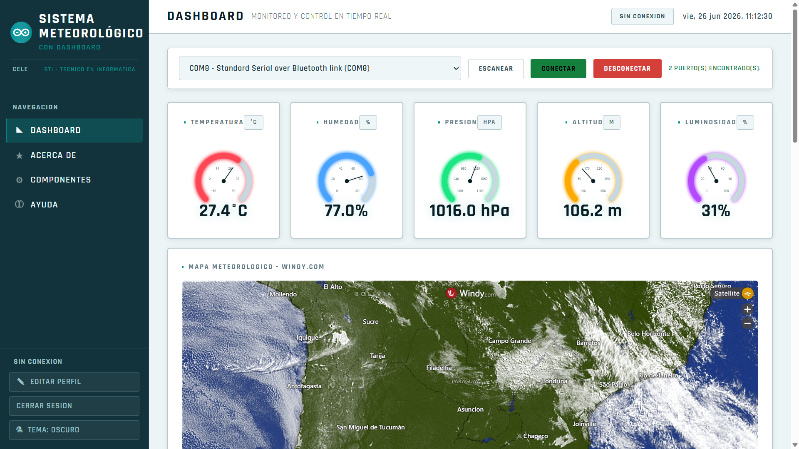
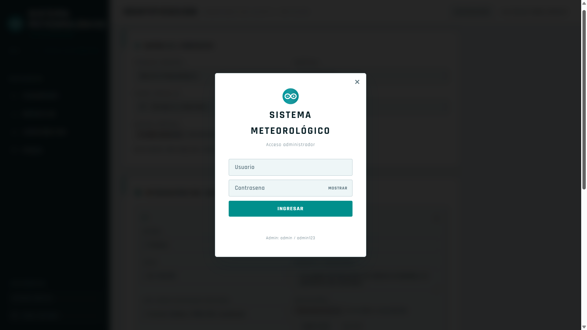
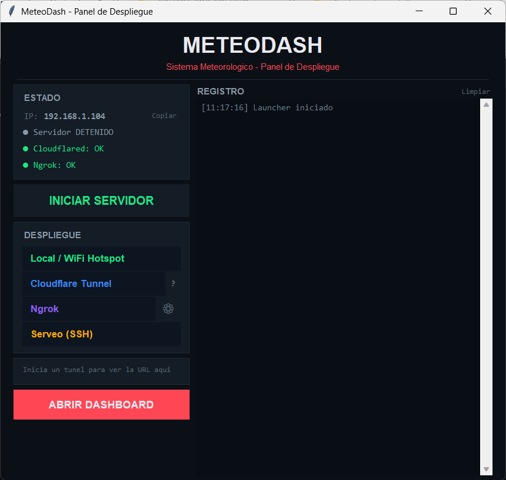
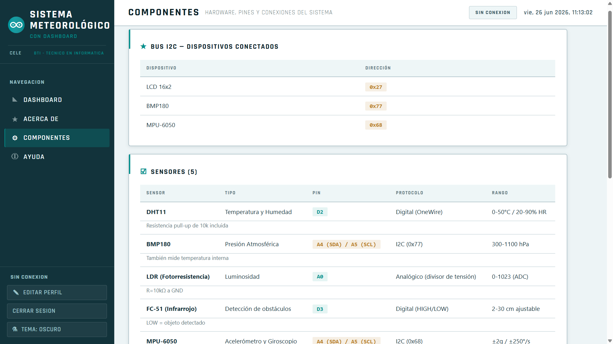
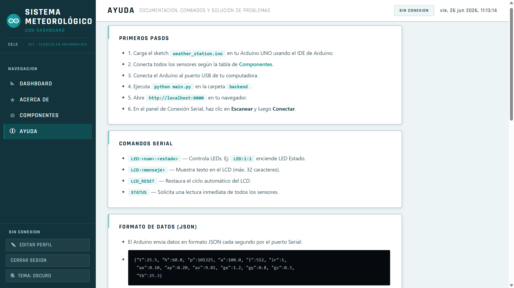
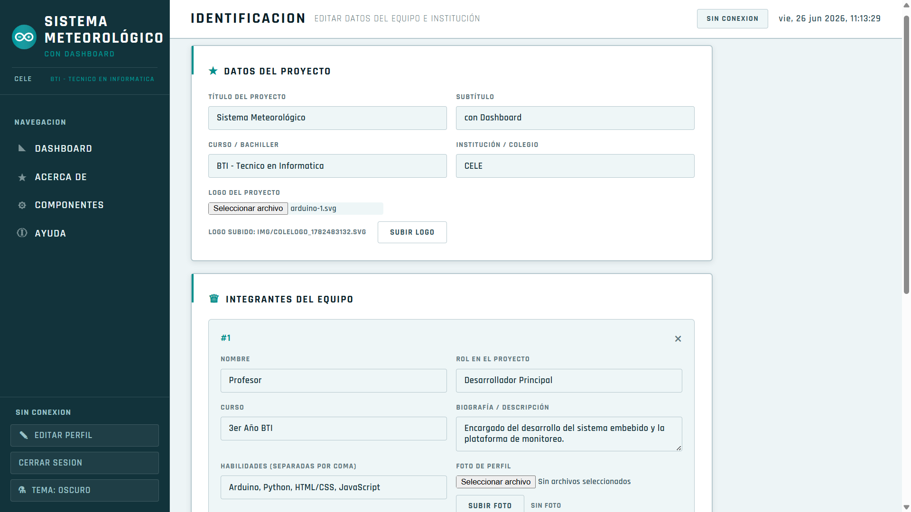

# MeteoDash - Estación Meteorológica con Arduino


MeteoDash es un proyecto escolar de estación meteorológica basado en Arduino y apoyado por un dashboard web. El prototipo mide variables ambientales locales, envía los datos a una computadora y los muestra en una interfaz visual con medidores, gráficas, historial, controles y referencia meteorológica externa mediante Windy.

El objetivo principal del proyecto es demostrar el funcionamiento de un sistema de monitoreo ambiental construido con sensores accesibles. El dashboard, los instaladores y los accesos directos funcionan como material de apoyo para que la demostración sea más clara, ordenada y fácil de ejecutar en otras computadoras.

## Capturas

Vista principal del dashboard con medidores, conexión serial y mapa meteorológico embebido:



Otras vistas del sistema:

| Inicio de sesión | Panel de despliegue |
| --- | --- |
|  |  |

| Componentes | Ayuda |
| --- | --- |
|  |  |

| Edición de perfiles |
| --- |
|  |

## Descarga recomendada

Para usar el proyecto en otra computadora, lo más simple es descargar el paquete publicado en la sección **Releases** del repositorio de GitHub.

Después de descargarlo:

1. Descomprimir el archivo `.zip`.
2. Abrir la carpeta descomprimida.
3. Ejecutar `1 - Instalar MeteoDash`.
4. Ejecutar `2 - Abrir MeteoDash`.

La aplicación abre un servidor local y permite ingresar al dashboard desde el navegador.

```text
http://localhost:8000
```

## Uso rápido para alumnos

Primera vez:

1. Abrir `1 - Instalar MeteoDash` con doble clic.
2. Esperar a que termine la instalación.
3. Si Windows solicita permisos, aceptar.
4. Si el Arduino no aparece como puerto COM, abrir `3 - Arduino IDE Legacy Drivers`.
5. Instalar Arduino IDE Legacy y aceptar los drivers USB.

Para iniciar la demostración:

1. Conectar el Arduino por USB.
2. Abrir `2 - Abrir MeteoDash`.
3. Presionar **Iniciar servidor**.
4. Presionar **Abrir dashboard**.
5. Iniciar sesión.
6. Seleccionar el puerto COM desde el dashboard.
7. Presionar **Conectar**.

Credenciales de demostración:

```text
Administrador: admin / admin123
Visitante:     visitante / visitante123
```

Si las credenciales no funcionan después de mover el proyecto a otra computadora, cerrar MeteoDash y ejecutar:

```text
4 - Reparar Credenciales
```

## ¿Hace falta instalar Python?

La versión actual no es una app portable totalmente independiente. El proyecto usa un instalador escolar que prepara un entorno local `.venv` dentro de la carpeta del proyecto.

El instalador:

- Busca Python en la computadora.
- Si no lo encuentra, intenta usar el instalador incluido en `instaladores/`.
- Crea el entorno local `.venv`.
- Instala las dependencias de `backend/requirements.txt`.
- Repara las credenciales de demostración.

Esto evita que los alumnos tengan que escribir comandos y mantiene las dependencias aisladas del resto del sistema.

## Hardware necesario

- Arduino UNO R3 o compatible.
- Sensor DHT11 para temperatura y humedad.
- Sensor BMP180 para presión atmosférica y altitud estimada.
- LDR con divisor de tensión para luminosidad.
- Sensor infrarrojo FC-51 para detección de obstáculos.
- Sensor MPU-6050 para acelerómetro y giroscopio.
- Pantalla LCD 16x2 con módulo I2C.
- Módulo Bluetooth HC-06.
- LEDs de estado.
- Resistencias y jumpers.
- Cable USB de datos.

## Conexiones principales

```text
D2  -> DHT11 DATA
D3  -> Sensor infrarrojo FC-51
D4  -> LED de estado
D5  -> LED de transmisión
D6  -> LED de alerta
D7  -> LED de actividad
D10 -> HC-06 TX
D11 -> HC-06 RX
A0  -> LDR
A4  -> SDA: BMP180, MPU-6050 y LCD I2C
A5  -> SCL: BMP180, MPU-6050 y LCD I2C
```

Dispositivos I2C usados:

```text
LCD I2C   -> 0x27
BMP180    -> 0x77
MPU-6050  -> 0x68
```

## Firmware Arduino

El sketch principal está en:

```text
arduino/weather_station/weather_station.ino
```

El Arduino trabaja a:

```text
9600 baudios
```

El microcontrolador lee sensores aproximadamente cada segundo y envía una línea JSON por Serial y Bluetooth.

Ejemplo de datos enviados:

```json
{
  "t": 25.5,
  "h": 60.0,
  "p": 101325,
  "a": 100.0,
  "l": 512,
  "ir": 1,
  "ax": 0.10,
  "ay": 0.20,
  "az": 9.81,
  "gx": 1.2,
  "gy": 0.8,
  "gz": 0.3,
  "tb": 25.3
}
```

Campos principales:

| Campo | Descripción |
| --- | --- |
| `t` | Temperatura principal del DHT11 |
| `h` | Humedad relativa |
| `p` | Presión atmosférica en Pa |
| `a` | Altitud estimada |
| `l` | Luminosidad relativa |
| `ir` | Estado del sensor infrarrojo |
| `ax`, `ay`, `az` | Aceleración |
| `gx`, `gy`, `gz` | Giroscopio |
| `tb` | Temperatura interna del BMP180 |

Comandos aceptados por el Arduino:

```text
LED:<numero>:<0|1>
LCD:<mensaje>
LCD_RESET
BT_NAME:<nombre>
STATUS
```

## Dashboard

El dashboard permite:

- Ver lecturas en tiempo real.
- Consultar gráficas históricas.
- Conectar y desconectar el puerto serial.
- Enviar comandos al Arduino.
- Controlar LEDs.
- Escribir mensajes en el LCD.
- Renombrar el módulo Bluetooth HC-06.
- Activar modo test sin Arduino.
- Editar datos del proyecto, integrantes y logo.
- Comparar visualmente con Windy mediante un mapa embebido.

Windy se usa como referencia visual externa. No valida automáticamente los datos del prototipo ni reemplaza estaciones meteorológicas oficiales.

## Tecnologías utilizadas

| Capa | Tecnología | Función |
| --- | --- | --- |
| Microcontrolador | Arduino UNO | Lectura de sensores y envío de datos |
| Firmware | Arduino C/C++ | Lógica embebida del prototipo |
| Backend | Python, FastAPI, Uvicorn | API local y servidor del dashboard |
| Comunicación serial | PySerial | Lectura del puerto COM |
| Base de datos | SQLite | Historial local de mediciones |
| Tiempo real | WebSocket | Actualizacion del dashboard |
| Frontend | HTML, CSS, JavaScript | Interfaz web |
| Gráficas | Chart.js | Históricos y visualización |
| Medidores | Canvas API | Gauges radiales |
| Seguridad escolar | JWT, passlib, bcrypt | Inicio de sesión y roles |
| Referencia externa | Windy iframe | Comparación meteorológica visual |
| Despliegue | Tkinter, BAT, accesos directos | Uso simplificado en Windows |

## Estructura del proyecto

```text
Sistema meteorológico (con Dashboard)/
  1 - Instalar MeteoDash.lnk
  2 - Abrir MeteoDash.lnk
  3 - Arduino IDE Legacy Drivers.lnk
  4 - Reparar Credenciales.lnk
  LEEME_ALUMNOS.txt
  launcher.py
  launcher_gui.py
  launcher_config.json
  arduino/
    weather_station/
      weather_station.ino
  backend/
    main.py
    auth.py
    database.py
    requirements.txt
  dashboard/
    index.html
    css/
    js/
    config/
    img/
  docs/
    screenshots/
  instaladores/
    python-3.12.10-amd64.exe
    arduino-1.8.19-windows.exe
  soporte/
    INSTALAR_METEODASH.bat
    EJECUTAR_METEODASH.bat
    INSTALAR_ARDUINO_LEGACY.bat
    REPARAR_CREDENCIALES.bat
```

## Drivers USB y Arduino Legacy

El instalador de MeteoDash prepara Python y las dependencias del dashboard, pero no siempre puede hacer que Windows reconozca todas las placas Arduino compatibles.

Si el puerto COM no aparece:

1. Verificar que el cable USB sea de datos.
2. Probar otro puerto USB.
3. Abrir el Administrador de dispositivos.
4. Ejecutar `3 - Arduino IDE Legacy Drivers`.
5. Instalar Arduino IDE Legacy y aceptar los drivers USB.
6. Desconectar y conectar nuevamente el Arduino.

Esta opción se incluye porque muchas placas compatibles son detectadas correctamente después de instalar Arduino IDE Legacy.

## Solución de problemas

### No aparece el puerto COM

- Revisar el cable USB.
- Instalar drivers con `3 - Arduino IDE Legacy Drivers`.
- Cerrar Arduino IDE, monitor serial u otros programas que puedan estar usando el puerto.
- Desconectar y volver a conectar la placa.

### El dashboard abre pero no recibe datos

- Verificar que el Arduino tenga cargado el sketch correcto.
- Confirmar que la velocidad sea `9600`.
- Seleccionar el puerto COM correcto.
- Presionar **Conectar**.
- Revisar que el Arduino no este usando otro firmware.

### No reconoce admin / admin123

Ejecutar:

```text
4 - Reparar Credenciales
```

Después cerrar y volver a abrir MeteoDash.

### No instala dependencias

- Revisar la conexión a internet.
- Ejecutar nuevamente `1 - Instalar MeteoDash`.
- Si Python no se instala automáticamente, abrir `instaladores/python-3.12.10-amd64.exe`.

### Windy no carga

- Revisar la conexión a internet.
- El dashboard puede funcionar localmente sin Windy.
- Windy es solo una referencia visual externa.

## Alcance educativo

MeteoDash es un prototipo escolar de monitoreo ambiental. Puede medir variables locales y mostrarlas de forma comprensible, pero no reemplaza instrumentos meteorológicos profesionales ni sistemas certificados.

En una demostración aeroportuaria simulada, el proyecto puede ayudar a explicar conciencia situacional, condiciones ambientales, presencia en zonas restringidas y comparación con referencias meteorológicas en línea. No debe usarse para navegación aérea, control de tránsito aéreo, despacho de vuelos ni decisiones operativas reales.

## Recomendaciones para publicar en GitHub

Para el repositorio:

- Mantener el codigo fuente, firmware, dashboard y documentos.
- No subir `.venv`.
- No subir tokens personales de ngrok.
- No publicar credenciales privadas.
- Conservar solo credenciales de demostración si el proyecto es escolar.

Para el release:

- Publicar un `.zip` listo para alumnos.
- Incluir accesos directos numerados.
- Incluir instaladores necesarios en `instaladores/` si el peso del release lo permite.
- Aclarar que Arduino IDE Legacy se usa para drivers USB cuando sea necesario.

## Documentación académica

El proyecto incluye documentos de apoyo en la carpeta `docs/`, incluyendo una versión extendida de tesis con enfoque de prototipo escolar y demostración en entorno aeroportuario simulado.

## Licencia

Este proyecto se distribuye bajo una licencia personalizada de uso educativo y demostrativo no comercial.

Se permite usar, estudiar, modificar y compartir el proyecto con fines escolares, académicos, demostrativos o de feria científica, manteniendo el aviso de autoría y la licencia original.

No se permite vender el proyecto, usarlo en cursos pagos, integrarlo en servicios comerciales ni percibir dinero por su uso sin autorización escrita del titular del proyecto. Ver [LICENSE](LICENSE).
